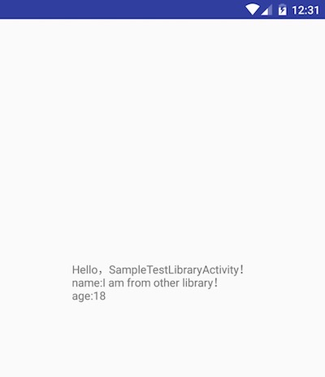

# DUnit
DUnit is used to test or display functions or components to others.

![img1][1] ![img2][2] ![img3][3] ![img4][4]

# Download

```groovy
dependencies {
  compile 'top.ftas:dunit:2.1'
  annotationProcessor 'top.ftas:dunit-compiler:2.1'
}
```

# Usage1

Add annotations to existing activities：
	
	```java
	@DUnit
	public class BaseActivity extends Activity{ /* Do something */ }
	```

# Usage2

1. Define groups:

	```java
	@DUnitGroup("HttpGroup")
	public class HttpGroup extends DUnitRootGroup{}
	```

	or

	```java
	@DUnitGroup
	public class ObjectGroup {
	}
	```

2. Create a display unit:

	```java
	@DUnit(
			name = "RetrofitDisplayUnit",
			group = HttpGroup.class
	)
	public class RetrofitDisplayUnit extends AbstractDisplayUnit{
		@Override
		public void callUnit() { /* Do something */ }
	}
	```

# Usage3

### java

	```sh
	android {
		defaultConfig {
			javaCompileOptions {
				annotationProcessorOptions {
					arguments = [DUNIT_MODULE_NAME : "sample"]
				}
			}
		}
	}
	```
	
### kotlin

	```sh
	kapt {
		arguments {
			arg("DUNIT_MODULE_NAME", "sample_kotlin")
		}
	}
	```

# Usage4 paramJson

```java
@DUnit(name = "SampleTestLibraryActivity - paramJson",paramJson = "{\"testName\":\"I am from other library！\",\"testAge\":18}")
public class SampleTestLibraryActivity extends Activity{
    @Override
    protected void onCreate(@Nullable Bundle savedInstanceState) {
        super.onCreate(savedInstanceState);
        setContentView(R.layout.activity_sample_test_library);
        TextView textView = (TextView) findViewById(R.id.hello_txt);

        String str = "Hello，SampleTestLibraryActivity！";
        Intent intent = getIntent();
        if (intent != null) {
            str += "\nname:" + intent.getStringExtra("testName");
            str += "\nage:" + intent.getIntExtra("testAge", -1);
        }

        textView.setText(str);
    }
}
```




 [1]: img/small/01.png
 [2]: img/small/02.png
 [3]: img/small/03.png
 [4]: img/small/04.png
